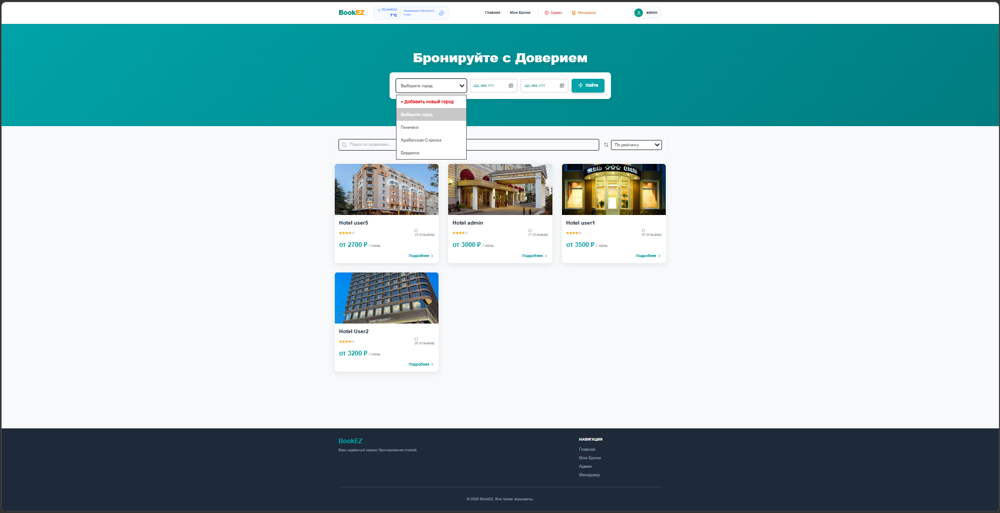
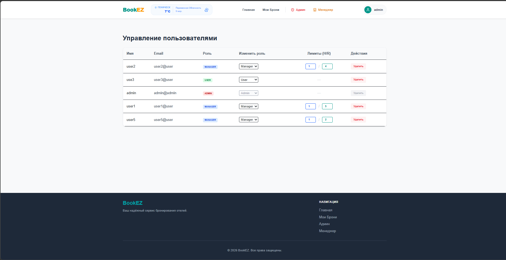
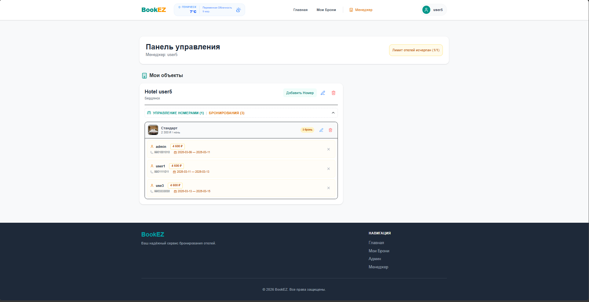
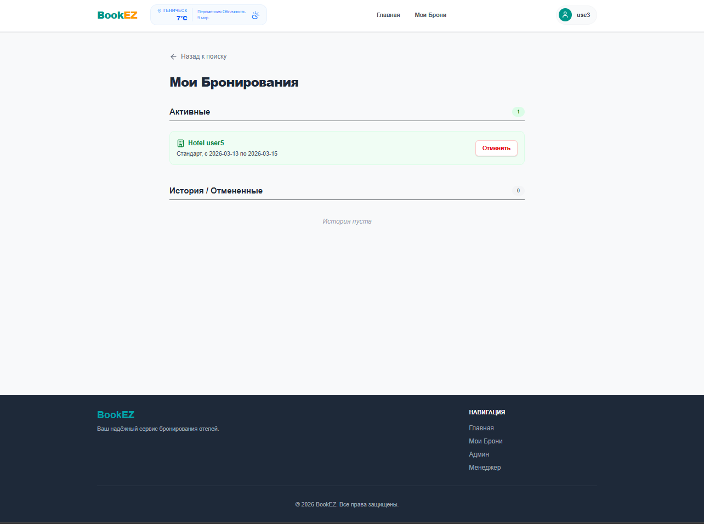
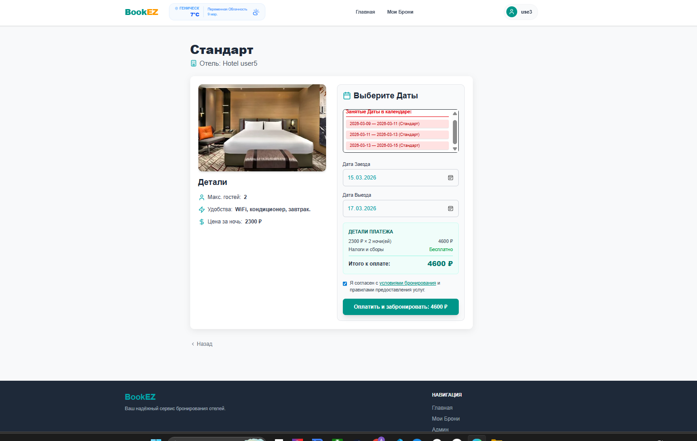
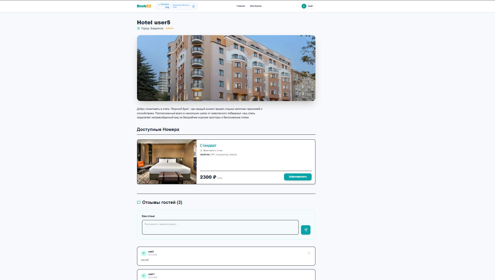

# BookEz — Система бронирования отелей

BookEz — это современное Fullstack-приложение, реализующее полный цикл бронирования номеров в отеле: от поиска и фильтрации до полного управления отелем и администрирования контента.

Приложение развернуто на облачном сервере и доступно по адресу:

**[http://85.239.63.108](http://85.239.63.108)**

## Основные возможности
- **Поиск и фильтрация:** Поиск отелей по городам, датам и названию.
- **Управление бронированием:** Система создания и отслеживания заказов.
- **Личный кабинет:** Авторизация пользователей с использованием JWT-токенов.
- **Панель менеджера:** Возможность добавления новых отелей и управления контентом.
- **Панель админ:** Возможность переназначать роли и количество доступных для создания отелей и номеров
- **Загрузка фото:** Интеграция с Multer для хранения изображений отелей.

## Особенности
- **SPA Архитектура:** Быстрая работа интерфейса без перезагрузок страниц
- **RBAC (Role-Based Access Control):** Продвинутая система прав (Admin/Manager/User)
- **Безопасность:** Хеширование паролей через bcrypt и защищенные маршруты на фронтенде.
- **Интерактивность:** Система отзывов, моментальное обновление статусов бронирования.
- **Media Management:** Обработка и хранение изображений через Multer с привязкой к сущностям БД.

## Технологический стек

### Frontend
- **React 19 (SPA), TypeScript:** ядро, функциональные компоненты и хуки.
- **Redux:** стейт-менеджмент (Thunk для асинхронных операций).
- **React Router DOM:** навигация.
- **React Hook Form + Yup:** работа с формами(схемная валидация).
- ** Tailwind CSS 4 + Lucide React:** стилизация и иконки.
- **Vite, ESLint, Prettier:**  сборка и инструменты.

### Backend
- **Node.js, Express, TypeScript.:** серверная логика и REST API.
- **MongoDB + Mongoose ODM:** база данных и моделирование данных.
- **JWT, Bcrypt.js:** аутентификация пользователей (Stateless session, хеширование паролей).
- **Multer:** загрузка изображений(обработка Multipart/form-data).
- **CORS middleware:** безопасность .

### DevOps & Deployment:
* **Docker & Docker Compose** — контейнеризация приложения и базы данных.
* **Timeweb Cloud** — хостинг (VPS на Ubuntu).
* **Linux (Ubuntu)** — администрирование сервера.

Проект полностью подготовлен к деплою через Docker. В корне проекта находится многоэтапный `Dockerfile`.

### Сборка и запуск:

### Инструкция: Как запустить проект 

Клонируйте репозиторий:
- git clone [https://github.com/Andrey-G1Thub/bookez-hotel-booking.git](https://github.com/Andrey-G1Thub/bookez-hotel-booking.git)

Настройте переменные окружения в файле .env

 Запустите проект через Docker
- docker-compose up --build

### Инструкция: Как запустить проект локально 
### backend
* cd backend
* npm install
* npm run dev

### frontend
* cd frontend
* npm install
* npm run dev

